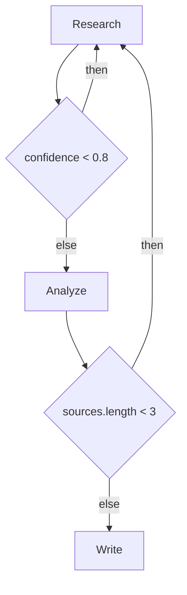

# Conditional Edges for Summon Framework

Conditional edges enable rituals to branch based on runtime conditions (e.g., "if confidence < 0.8, loop back to research"). The framework handles routing (fast), while the LLM provides evaluation (smart).

## Overview

```
┌──────────────┐      ┌──────────────┐      ┌──────────────┐
│   Research   │ ──▶  │    Analyze   │ ──▶  │    Write     │
└──────────────┘      └──────────────┘      └──────────────┘
                              │
                              ▼
                       ┌──────────────┐
                       │ Quality Check│
                       │ confidence   │
                       │    < 0.8?    │
                       └──────────────┘
                          │          │
                    (yes) │          │ (no)
                          ▼          ▼
                   ┌──────────┐  ┌──────────┐
                   │ Research │  │  Write   │
                   │ (retry)  │  │(continue)│
                   └──────────┘  └──────────┘
```

## Quick Start

### 1. Define Conditions in YAML

```yaml
name: adaptive-researcher
version: 1.0.0

steps:
  - id: research
    name: Research Phase
    agent: researcher
    
  - id: analyze
    name: Analysis Phase
    agent: analyzer
    dependsOn: [research]
    
  - id: write
    name: Writing Phase
    agent: writer
    dependsOn: [analyze]

conditions:
  - id: quality-check
    from: analyze
    condition: "confidence < 0.8"
    then: research    # Loop back
    else: write       # Continue
    
  - id: completeness-check
    from: research
    condition: "sources.length < 3"
    then: research    # Stay and gather more
    else: analyze

evaluation:
  model: default
  timeout: 5s
  max_retries: 2
```

### 2. Run with Condition Tracing

```bash
summon conditions run adaptive-researcher.yaml "Research quantum computing"
```

### 3. Validate Conditions

```bash
summon conditions validate adaptive-researcher.yaml
```

### 4. Visualize Flow

```bash
summon conditions graph adaptive-researcher.yaml
```

## Condition Types

### Natural Language (Default)

```yaml
conditions:
  - id: quality-check
    from: analyze
    condition: "confidence < 0.8"
    then: research
    else: write
```

The condition is sent to an LLM for evaluation along with the step output.

### Expression-Based

```yaml
conditions:
  - id: length-check
    from: write
    condition: "${output.word_count} < 500"
    then: write
    else: complete
```

Uses JavaScript expression evaluation with context variables.

### Function-Based (Advanced)

```yaml
conditions:
  - id: custom-check
    from: analyze
    condition: "(ctx) => ctx.stepResults.get('analyze').output.quality < 0.8"
    then: research
    else: write
```

Direct JavaScript function for maximum flexibility.

## CLI Commands

### `summon conditions validate <ritual.yaml>`

Validates condition syntax and references.

```bash
$ summon conditions validate adaptive-researcher.yaml

🔄 Validating 2 condition(s)

✓ All conditions are valid

Conditions:
  • quality-check: analyze → (then: research, else: write)
    Condition: "confidence < 0.8"
  • completeness-check: research → (then: research, else: analyze)
    Condition: "sources.length < 3"
```

### `summon conditions run <ritual.yaml> <goal>`

Runs a ritual with condition tracing.

```bash
$ summon conditions run adaptive-researcher.yaml "Research AI trends"

🔥 Starting ritual: ritual-v2-...
   Goal: Research AI trends
   Steps: 3
   Conditions: 2
   Max iterations: 50

🔄 [3] Condition: quality-check
   From: analyze
   Evaluated: "confidence < 0.8"
   Result: then → research
   Reasoning: Analysis confidence (0.65) is below threshold...

==================================================
Ritual ✓ completed
  Execution path: research → analyze → research → analyze → write
  Total steps executed: 5
  Condition evaluations: 2

  Step iterations:
    • research: 2 iterations
    • analyze: 2 iterations
```

### `summon conditions graph <ritual.yaml>`

Generates a Mermaid diagram.

```bash
$ summon conditions graph adaptive-researcher.yaml


```

## API Usage

### Basic Usage

```typescript
import { createRitualEngineV2 } from '@summon/framework';

const engine = createRitualEngineV2({
  maxIterations: 50,
  traceConditions: true,
  onConditionEvaluated: (trace, ritual) => {
    console.log(`Condition ${trace.conditionId}: ${trace.result.outcome}`);
  }
});

const ritual = await engine.createRitual(goal, plan);
const result = await engine.executeRitual(ritual.id);

console.log('Execution path:', result.executionPath);
console.log('Condition traces:', result.traces);
```

### Programmatic Condition Evaluation

```typescript
import { createConditionEngine } from '@summon/framework';

const engine = createConditionEngine({
  model: 'gpt-4o-mini',
  timeout: 5000,
  maxRetries: 2
});

const result = await engine.evaluate(
  {
    id: 'quality-check',
    from: 'analyze',
    condition: 'confidence < 0.8',
    then: 'research',
    else: 'write'
  },
  {
    stepResults: new Map([['analyze', {
      stepId: 'analyze',
      success: true,
      output: { confidence: 0.65, summary: '...' },
      metadata: { tokensUsed: 1000, durationMs: 2000, model: 'gpt-4' }
    }]]),
    currentStepId: 'analyze',
    userQuery: 'Research quantum computing',
    accumulatedOutput: '...'
  }
);

console.log(result.outcome); // 'then' or 'else'
console.log(result.reasoning); // Explanation
```

## Configuration Reference

### Condition Config

| Field | Type | Required | Description |
|-------|------|----------|-------------|
| `id` | string | Yes | Unique identifier |
| `from` | string | Yes | Step ID that triggers condition |
| `condition` | string | Yes | Expression or natural language condition |
| `then` | string | Yes | Step ID if condition is true (or 'complete') |
| `else` | string | Yes | Step ID if condition is false (or 'complete') |
| `evaluation` | object | No | Override global evaluation settings |

### Evaluation Settings

| Field | Type | Default | Description |
|-------|------|---------|-------------|
| `model` | string | 'default' | Model for natural language evaluation |
| `timeout` | string | '5s' | Evaluation timeout (e.g., '5s', '1m') |
| `max_retries` | number | 2 | Retries on evaluation failure |

## Example Use Cases

### 1. Adaptive Research

```yaml
conditions:
  - from: analyze
    condition: "insufficient_data"
    then: research
    else: write
```

### 2. Quality Gates

```yaml
conditions:
  - from: draft
    condition: "grammar_errors > 5"
    then: edit
    else: review
```

### 3. Auto-escalation

```yaml
conditions:
  - from: support
    condition: "complexity == 'high'"
    then: escalate_to_human
    else: auto_resolve
```

### 4. Iterative Refinement

```yaml
conditions:
  - from: review
    condition: "score < 0.9 && iteration < 3"
    then: refine
    else: complete
```

## Best Practices

1. **Keep conditions simple**: Prefer clear metric comparisons over complex logic
2. **Set iteration limits**: Always use `maxIterations` to prevent infinite loops
3. **Use fast models for routing**: Use cheaper models for condition evaluation
4. **Log condition traces**: Enable tracing to debug routing decisions
5. **Validate before running**: Use `summon conditions validate` to catch errors early

## Error Handling

### Common Errors

| Error | Cause | Solution |
|-------|-------|----------|
| `Condition creates infinite loop` | Both branches return to source | Change one branch to go to a different step |
| `Step "X" has N conditions` | Multiple conditions from same step | Combine into single condition or restructure |
| `"from" step not found` | Referenced step doesn't exist | Check step IDs match |
| `"then"/"else" target not found` | Target step doesn't exist | Use valid step ID or 'complete' |

### Timeout Handling

If condition evaluation times out, it defaults to the 'else' branch. This ensures progress even with slow evaluation.

## Integration with Summon Academy

The TUI displays condition evaluations in real-time:

```
┌─ Round 3: analyze ───────────────────────────[✓]─┐
│  Analysis complete                                 │
│  Confidence: 0.65                                  │
└────────────────────────────────────────────────────┘
   🔄 CONDITION TRIGGERED: "confidence < 0.8"
   ↓ Routing to: research (loop back)
┌─ Round 4: research (retry) ──────────────────[→]─┐
│  Gathering additional sources...                   │
└────────────────────────────────────────────────────┘
```

Press `c` during training to view detailed condition history.

## Performance Considerations

- Expression-based conditions are evaluated locally (fast)
- Natural language conditions require an LLM call (slower)
- Consider caching repeated evaluations
- Use timeouts to prevent blocking

## License

MIT - See LICENSE for details
